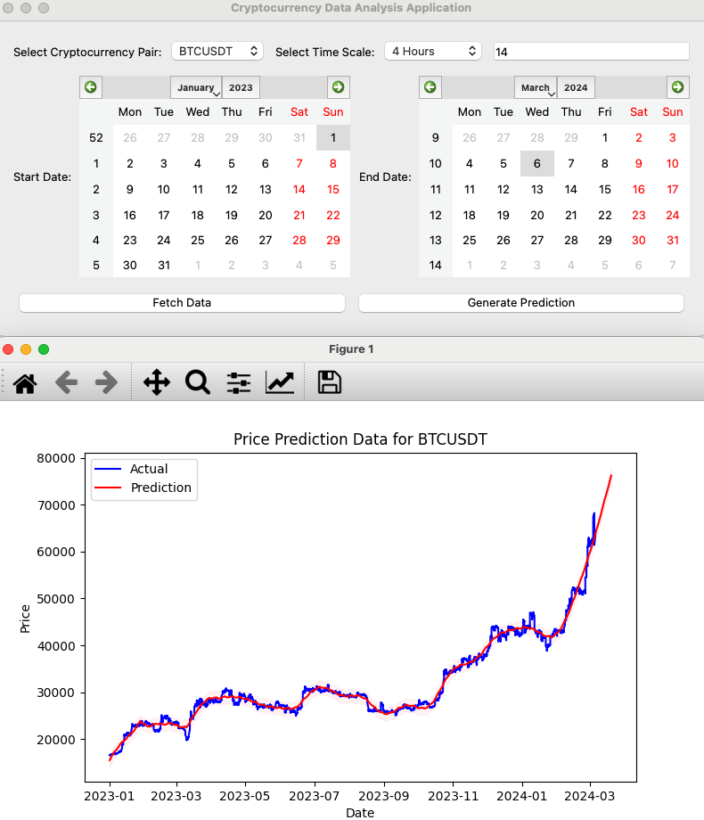

# Cryptocurrency Data Analysis Application

This is a PyQt5-based application that allows users to generate price forecasts for a specific cryptocurrency pair. Additionally, it includes functionality to retrieve data for a specific time interval.

# Requirements:

- Python 3.x
- PyQt5
- pandas
- binance
- matplotlib
- prophet

# Installation:

1. If you're using Anaconda, install the required libraries with the following command:
```bash
conda install -c anaconda pyqt pandas matplotlib
```
```bash
pip install python-binance fbprophet
```
2. Install the PyQt5, pandas, binance, and matplotlib libraries.
```bash
pip install pyqt5 pandas matplotlib
```
```bash
pip install python-binance fbprophet
```

Note:
These plans may change depending on time and resources.

# Usage:

1. Run the application.
2. Select the cryptocurrency pair, time scale, start, and end date.
3. Click the "Fetch Data" button to retrieve historical data from Binance.
4. After fetching the data, click the "Generate Forecast" button to create a price forecast.
5. Examine the graph to visualize the forecasted price results.

# Notes:

- You should provide your Binance API keys in the `config.py` file. (You can leave the API keys blank.)
- This application is not intended for real trading and is for educational and testing purposes only.



Thank you in advance for your contributions!

